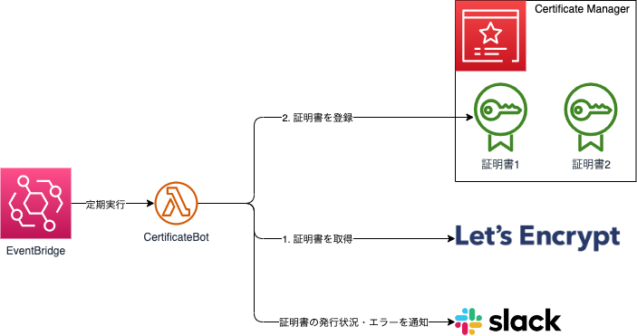

# certificate-bot



## コマンド

**ビルド**

```sh
sam build --use-container
```

**デプロイ**

```sh
sam deploy --guided --capabilities CAPABILITY_NAMED_IAM
```

**ローカル実行**

```sh
sam local invoke --env-vars resources/env.json --event resources/event.json
```

## デプロイ & 実行

1. Let's Encrypt にメールアドレスを登録する。

   ```sh
   certbot register --agree-tos -m <メールアドレス>
   ```

1. 証明書を自動更新する Lambda を作成する。

   ```sh
   sam deploy --guided --capabilities CAPABILITY_NAMED_IAM
   ```

   **パラメータ**

   |   パラメータ名 | 備考                                                                                     |
   | -------------: | :--------------------------------------------------------------------------------------- |
   |    Environment | production/staging/development                                                           |
   |       SlackUrl | Slack Incoming Webhook の URL                                                            |
   | CertificateArn | Certificate Manager に登録されている証明書の ARN。指定しないと新規登録。指定すると更新。 |
   |          Event | `{"domains": [<ドメイン>, ...], "email_address": "<メールアドレス>"}` の形式             |

1. 最初の証明書を発行する。

   - コンソールから Lambda のテストを実行する。
   - パラメータの `Event` に設定したものと同じイベントで実行する。

1. CertificateArn を指定して、再度 Lambda をデプロイする。
